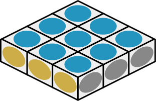
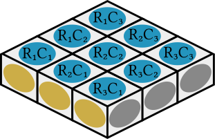
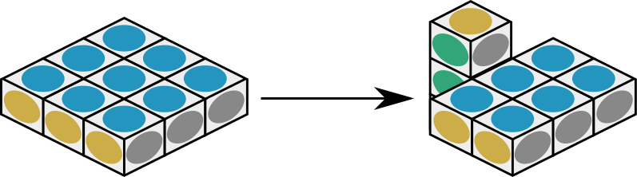
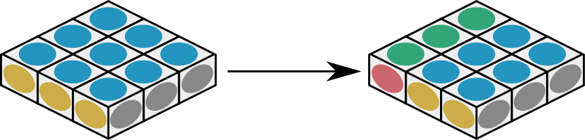
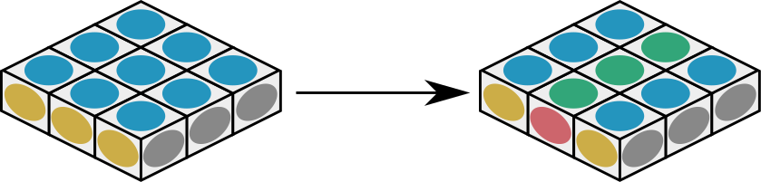
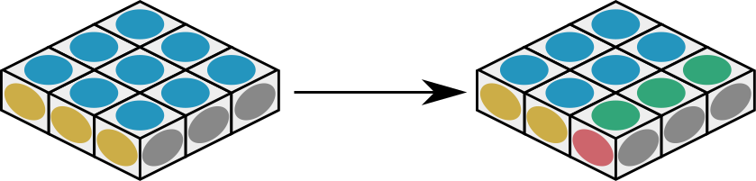
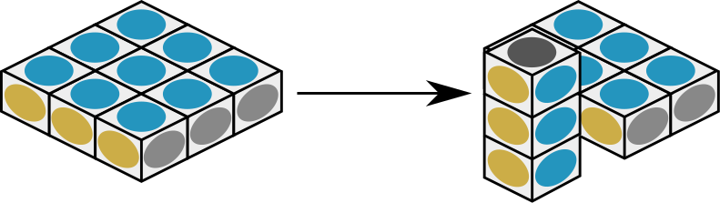
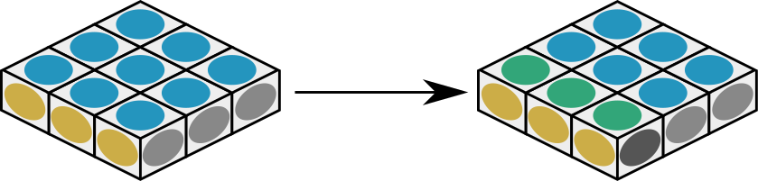
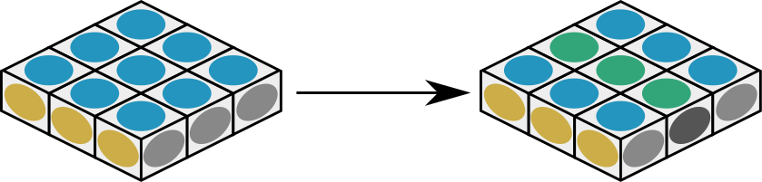
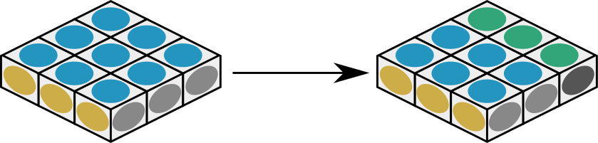

# Notation

## Pieces

## ¹→

## ¹↔

## ¹←

## ²↔

## ³↔

## ¹↓

## ¹↕

## ¹↑

## ²↕

## ³↕

# Additional notation

* [→] combines ¹→, ²→, and ³→ (all rows).

* [↔] combines ¹↔, ²↔, and ³↔ (all rows).

* [←] combines ¹←, ²←, and ³← (all rows).

* [↓] combines ¹↓, ²↓, and ³↓ (all columns).

* [↔] combines ¹↕, ²↕, and ³↕ (all columns).

* [↑] combines ¹↑, ²↑, and ³↑ (all columns).

* [↷] rotates the whole cube 90° clockwise around the top.

* [⟳] rotates the whole cube 180° around the top.

* [↶] rotates the whole cube 90° anticlockwise around the top.

# Solving the puzzle

This puzzle is one of the simplest variants of Rubik's cube.
Despite that the puzzle is as close to trivial as it gets,
it is often ranked as an expert-level puzzle with the highest
ranking.

## Step 0

Flatten the floppy to the form n × n × 1.

## Step 1

Work from the outside inwards to solve the puzzle.

# Algorithms

This puzzle is trivial, no algorithms necessary.
