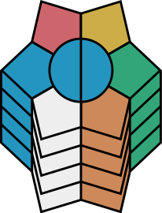

# Notation

## Columns

## ↗

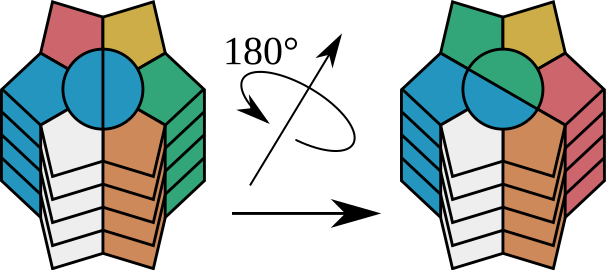

## →

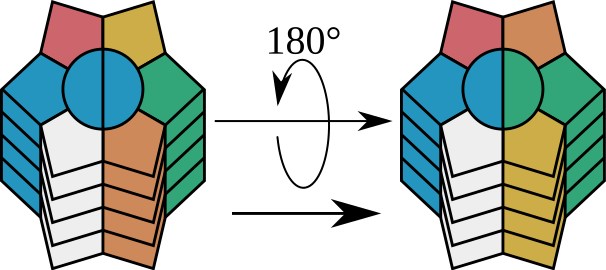

## ↘

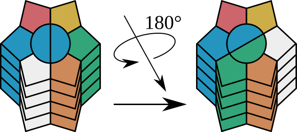

## ↙

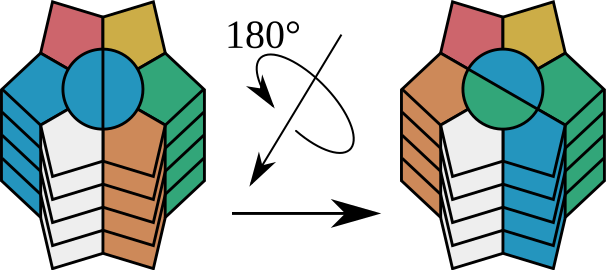

## ←

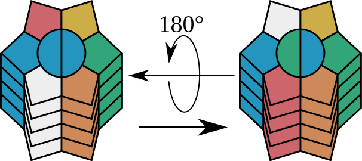

## ↖

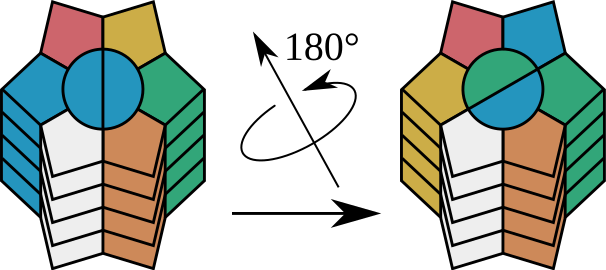

## ⤸₁¹

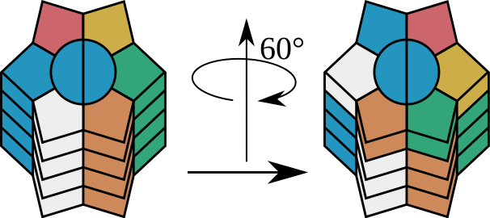

## ⤸₁²

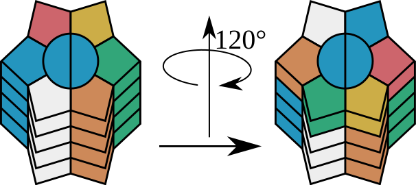

## ⤸₁³

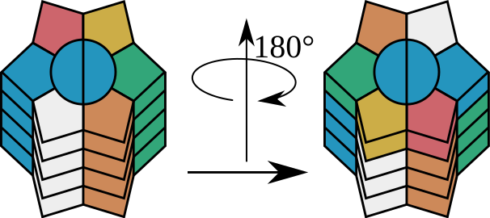

## ⤹₁²

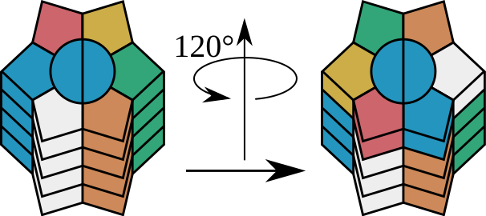

## ⤹₁¹

## ⤸₂¹

## ⤸₃¹

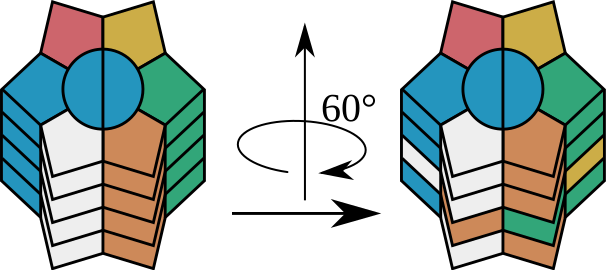

## ⤸₄¹

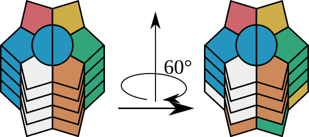

# Additional notation

* [↑], [↓], and [↕] combines ← and →.

* [↖] and [↘] combines ↗ and ↙.

* [↗] and [↙] combines ↖ and ↘.

* [⤸¹] rotates the whole cube 60° clockwise.

* [⤸²] rotates the whole cube 120° clockwise.

* [⤸³] rotates the whole cube 180°.

* [⤹²] rotates the whole cube 120° anticlockwise.

* [⤹¹] rotates the whole cube 60° anticlockwise.

# Solving the puzzle

This puzzle is one of the most difficult variants
of the rubik's cube. Despite this, it has 60
solved states, only one algorithm is necessary to
solve the puzzle, half of the puzzle can be solved
almost trivially, and with not much more thought
process it can be solved except for two pieces
swapped, and it is easy for a computer to find the
shortest solution (the god algorithm).

## Step 1

Solve one of the colums, except on the centre
layer if there is an odd number of layers. This
step is trivial.

## Step 2

Repeat Step 1 for a column directly left or right
to the column you solved in Step 1. This step
is almost trivial.

## Step 3

Repeat Step 1 for a column directly left or right
to the column you solved in Step 1 or Step 2. This
step is almost trivial.

## Step 4

Use the algorithm ⤸ⱼ²↘⤸ⱼ¹↘⤸ⱼ¹↗⤸ᵢ¹↗⤸ⱼ³ = (→ᵢ ↔ ↘ᵢ)(←ᵢ ↔ ←ⱼ),
where i the any layer and j its opposite layer,
to solve the a column next to an already solved column.
Do not solve the centre layer if the number of layers
are odd.

## Step 5

Repeat step 4 for a new column. After this step,
all columns should be solved except for on the
centre layer of the number of layers is odd.

## Step 6

Skip this step if the number of layers are even.
Solve the centre layer. Use the algorithm from
Step 4. To speed up the process, you can use
the algorithm ⤸ₐ³→⤸ₐ³→⤸ₐ³→ = (↗ₖ ↔ ↘ₖ), where k
is the centre layer and a is all layers above it.

## Step 7

If the centre circle is not solved, perform one
flip. That is, either ↗, →, ↘, ↙, ←, or ↖.

# Algorithms

i is any layer, j is i's opposite layer.

(⋆) means columns are reordered, possibly
with upside-down flipping.

## (→ᵢ ↔ ↘ᵢ)(←ᵢ ↔ ←ⱼ)

⤸ⱼ² ↘ ⤸ⱼ¹ ↘ ⤸ⱼ¹ ↗ ⤸ᵢ¹ ↗ ⤸ⱼ³

## (→ᵢ ↔ ↘ⱼ)(→ⱼ ↔ ↘ᵢ)(⋆)

↗ ⤸ᵢ¹ → ⤸ⱼ ↗ → ↘ ↗ ⤸ᵢ¹ → ⤸ⱼ

## (↗₂ ↔ ↘₂)

⤸₁³ → ⤸₁³ → ⤸₁³ →

Assuming 3 layers.

## (→₁ ↔ ←₁)(⋆)

→ ⤸₁¹ ↗ ⤹₁¹

Assuming 2 layers.

## (↗₁ ↔ →₂)(↗₂ ↔ →₁)(↙₁ ↔ ←₂)(↙₂ ↔ ←₁)

⤸₁¹ → ⤸₁² ↙ ⤹₁¹

Assuming 2 layers.

## (↗₁ ↔ ↙₂)(↗₂ ↔ ↙₁)

⤸₁¹ → ⤸₁² ↙ ⤹₁¹

Assuming 2 layers.

## (↗₁ → ↖₁ → ↘₂ → ↙₂ → →₁ → …)(↗₂ → ↖₂ → ↘₁ → ↙₁ → →₂ → …)

↗ ↘ ⤸₁¹ ↗ ⤹₁² ↘ ⤸₁¹

Assuming 2 layers.

## (↗₁ → ↘₁ → →₂ → …)(↗₂ → →₁ → ↘₂ → …)

⤸₁³ → ⤸₁² → ⤸₁³

Solves ⟨↘₁ →₁ ↗₁ | ↘₂ →₂ ↗₂⟩ = ⟨2 3 3 | 1 1 2⟩.

Assuming 2 layers.

## (↗₁ → ↖₂ → ↙₂ → →₂ → ↗₂ → ↘₂ → ↖₁ → ↙₁ → →₁ → ↘₁ → …)

⤸₁¹ ↗ → ⤸₁¹ → ↘ → ⤸₁²

Solves ⟨↘₁ →₁ ↗₁ | ↘₂ →₂ ↗₂⟩ = ⟨1 2 3 | 3 1 2⟩.

Assuming 2 layers.

## (↗₁ ↔ ↘₂)(⋆)

⤸₁¹ ↗ ⤸₁² → ↗ ↘ ↗ ⤸₁³

Solves ⟨↘₁ →₁ ↗₁ | ↘₂ →₂ ↗₂⟩ = ⟨1 2 3 | 3 2 1⟩.

Assuming 2 layers.

## (↗₁ → →₂ → ↘₁ → …)(↗₂ → ↘₂ → →₁ → …)(↖₁ ↔ ↙₁)(↖₂ ↔ ↙₂)

⤸₁¹ → ↗ ↘ ↗ ⤸₁¹

Solves ⟨↘₁ →₁ ↗₁ | ↘₂ →₂ ↗₂⟩ = ⟨1 1 2 | 2 3 3⟩.

Assuming 2 layers.

## (↗₁ → →₁ → ↙₁ → …)(↗₂ → →₂ → ↘₂ → ↘₁ → ↙₂ → …)

↗ ↘ ⤸₁¹ → ⤹₁¹ ←

Solves ⟨↘₁ →₁ ↗₁ | ↘₂ →₂ ↗₂⟩ = ⟨1 1 2 | 3 3 2⟩.

Assuming 2 layers.

## (↗₁ → ↗₂ → →₁ → ↘₂ → →₂ → ↗₃ → …)

↗ ⤸₁¹ ↗ ⤸₁² → ↗ ↘ ↗ ⤸₁³ ↘ ←

Solves ⟨↘₁ →₁ ↗₁ | ↘₂ →₂ ↗₂⟩ = ⟨1 3 1 | 2 3 2⟩.

Assuming 2 layers.

## (↗₁ ↔ ↖₁)(↗₂ → ↘₁ → →₂ → →₁ → ↖₂ → …)

↗ ⤸₁¹ ↘ → ⤸₁² → ↘ ⤸₁¹

Solves ⟨↘₁ →₁ ↗₁ | ↘₂ →₂ ↗₂⟩ = ⟨2 1 1 | 3 2 3⟩.

Assuming 2 layers.

## (↘₁ → →₂ → ↗₂ → ↙₂ → ↘₂ → ↙₁ → …)

⤸₁² ↗ ↘ → ⤸₁¹ ↘ ↗ ⤹₁²

Solves ⟨↘₁ →₁ ↗₁ | ↘₂ →₂ ↗₂⟩ = ⟨2 2 1 | 3 1 3⟩.

Assuming 2 layers.
