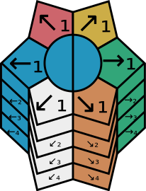
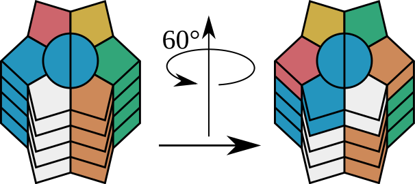
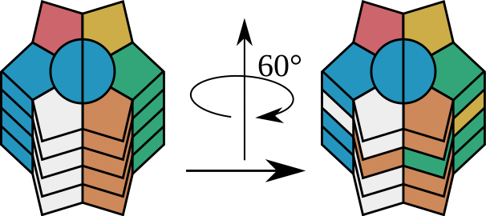

# Notation

## Columns

## ↗

## →

## ↘

## ↙

## ←

## ↖

## ⤸₁¹

## ⤸₁²

## ⤸₁³

## ⤹₁²

## ⤹₁¹

## ⤸₂¹

## ⤸₃¹

## ⤸₄¹

# Additional notation

* [↑], [↓], and [↕] conbines ← and →.

* [↖] and [↘] conbines ↗ and ↙.

* [↗] and [↙] conbines ↖ and ↘.

* [⤸¹] rotates the whole cube 60° clockwise.

* [⤸²] rotates the whole cube 120° clockwise.

* [⤸³] rotates the whole cube 180°.

* [⤹²] rotates the whole cube 120° anticlockwise.

* [⤹¹] rotates the whole cube 60° anticlockwise.
